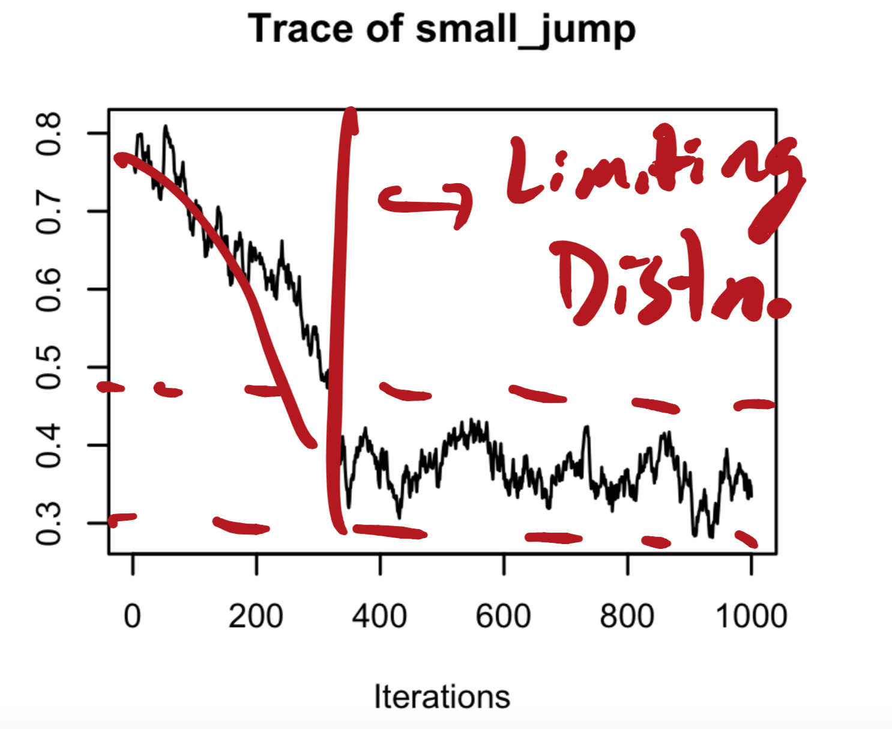
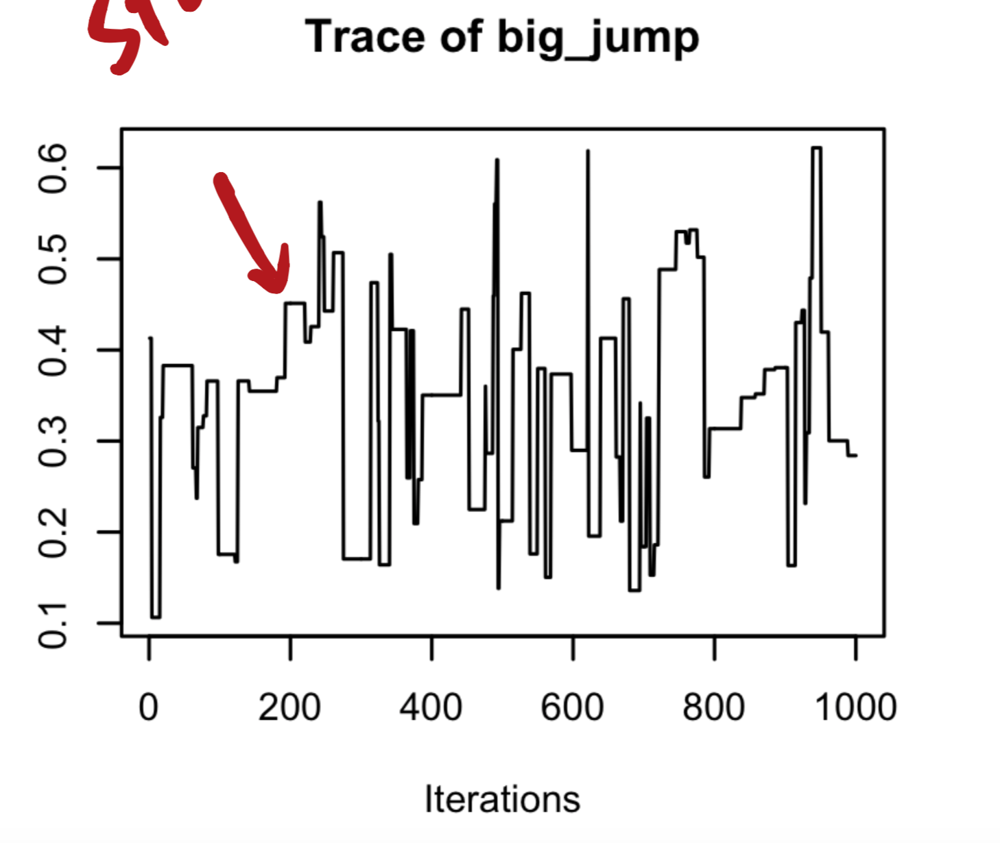

```{r, include=FALSE}
library(tidyverse)
library(mvtnorm)
knitr::opts_chunk$set(echo=TRUE, 
                      cache=FALSE, 
                      fig.width=5, 
                      fig.height=5,
                      fig.align='center',
                      echo=FALSE)
indent1 = '    '
indent2 = paste(rep(indent1, 2), collapse='')
indent3 = paste(rep(indent1, 3), collapse='')
r = function(x, digits=2){ round(x, digits=digits) }
ig <- function(file) {knitr::include_graphics(file)}

```


\section{Practice Problems}


1. We observe a sample of 10 observations from a normal distribution with mean $\mu$ and precision $\frac{1}{\sigma^2}$ The data, $y_1,..., y_{10}$, are such that

    #.  Suppose the value of $\frac{1}{\sigma^2}$ is known to be 0.004 and that our prior distribution is $p(\mu) \sim N(\mu_0=20, \sigma^2=100)$.  Find $p(\mu \mid y_1, ... y_{10})$. What is the 95\% HPD interval for $\mu$?

    #.  What is the posterior mean _estimate_ for the observed data? 
    #.  Now consider the posterior mean as an _estimator_ by ignoring the observed values $y_1, ... y_{10}$ and treat $Y_1, ... Y_{10}$ as random variables.  
    #.  What is the bias of the posterior mean, $E[\mu \mid Y_1, ... Y_{10}]$?
    #. What is the variance of the posterior mean, $E[\mu \mid Y_1, ... Y_{10}]$?
    #.  What is the MSE of $E[\mu \mid Y_1, ... Y_{10}]$?
    #. How close must the true $\mu$ be to the prior $\mu_0$ for the posterior mean estimator have equal MSE to the the maximum likelihood estimator, $\bar Y$?
 
 
*Solution*  
(a)

From the lecture notes, we know that
$$p(\mu \mid y, \sigma^2) \propto N(\mu_n, \sigma_n^2),$$

where $\mu_n = w \bar{y} + (1 - w)\mu_0, \quad w = \frac{n/\sigma^2}{n/\sigma^2 + 1/\tau^2}$  and $\sigma_n^2 = \frac{1}{n/\sigma^2 + 1/\tau^2}$


As given by the question, $n = 10$, $1/\sigma^2 = 0.004$, $\tau^2 = 100$, $\mu_0 = 20$, thus $w = 0.8$
```{r, include=F}
(10*0.004)/(10*0.004 + 1/100)
```

$$\mu_n = w \bar{y} + (1 - w)\mu_0 = 0.8 \bar{y} + 0.2*20 = 0.8 \bar{y} + 4$$
$$\sigma_n^2 = \frac{1}{n/\sigma^2 + 1/\tau^2} = 20 $$
```{r, include = F}
(1)/(10*0.004 + 1/100)
```


**95 \% HPD interval:**
$$\mu_n \pm 1.96 * \sigma_n =  (0.8 \bar{y} + 4) \pm 1.96*\sqrt{20} = (0.8 \bar{y} - 4.765386 ,\  0.8 \bar{y} + 12.76539)$$

(b)

Posterior mean estimate: $\mu_n = 0.8 \bar{y} + 4$


(c)

Posterior mean estimator: $\mu_n = 0.8 \bar{Y} + 4$

(d)

Bias: $E(0.8 \bar{Y} + 4 - \mu) = (1-w)*(\mu_0 - \mu) = 4 - 0.2*\mu$

(e)

Variance: $Var(0.8 \bar{Y} + 4) = w^2*Var(\bar{Y}) = 16$

(f)

MSE: MSE = bias^2 + Var = $(4 - 0.2*\mu)^2 + 16$

(g)

Let $$(4 - 0.2*\mu)^2 + 16 = Var(\bar{Y}) = 25,$$

solve it for $\mu$:

```{r}
(4 - sqrt(25 - 16)) / 0.2
```

Thus, when $\mu = 5$, the posterior mean estimator has equal MSE to the the maximum likelihood estimator.

  
    
2.  Draw a picture of a traceplot of a Markov Chain with high / low rejection rate.

*solution:*  

\pagebreak

\section*{Low rejection rate (small jumps, high autocorrelation):}

```{r, echo=FALSE, out.width = '80%'}

```


\pagebreak

\section*{High rejection rate (big jumps, "sticky" chain):}
```{r, echo=FALSE, out.width = '80%'}

```

3.  Consider Bayesian inference for p($\mu$, $\frac{1}{\sigma^2} \mid y)$, where  an $y \sim N(\mu, \sigma^2)$.  Assume the non-infromative prior disribution $p(\mu, \sigma^2) \propto 1/\sigma^2$.  This will lead to the diamond shaped posterior discussed in class and on the lecture notes.  Argue in words (no math needed) why the diamond shaped posterior makes sense? For what values of $\frac{1}{\sigma^2}$ does $\mu$ have the most posterior variability?  Lead posterior variability? Why?


*solution:*  
When the uninformative prior has been employed, we can see the relationship between $\mu$ and $1/\sigma^2$ based on the sampling distribution.

- If $1/\sigma^2$ is very large, $y$ is close to $\mu$, meaning that the observed data is very informative about $\mu$ and we can estimate $\mu$ with more certainty.

- If $1/\sigma^2$ is very small, $y$ can be far away from $\mu$. Based on the observed data, we cannot estimate $\mu$ precisely. The estimation has very large uncertainty. 


\pagebreak

4. First try this without referring to the lecture notes. Consider the following figure from the IQ example discussed in class.  This figure is based on the following model: $p(y \mid \mu, \sigma^2) \sim N(\mu, 13^2)$ and $p(\mu) \sim N(100, \frac{13^2}{\kappa_0})$.  

```{r, fig.width=6, fig.height=3, out.width="85%", warning=FALSE}

cols <- colorspace::sequential_hcl(3, "BluGrn")
  
par(mfrow = c(1, 2), mar = c(3, 3, 1, 1),  mgp = c(1.75, .75, 0))
  
b <- (100 - 112) ^ 2
s2 <- 13 ^ 2
n <- 1:50

k <- 1
brk1 <- (n / (k + n)) ^ 2 + n * (k / (k + n)) ^ 2 * b / s2
k <- 2
brk2 <- (n / (k + n)) ^ 2 + n * (k / (k + n)) ^ 2 * b / s2
k <- 3
brk3 <- (n / (k + n)) ^ 2 + n * (k / (k + n)) ^ 2 * b / s2
  
plot(range(n),
     c(0.4, 1.1),
     type = "n",
     xlab = "sample size",
     ylab = "relative MSE")
abline(h = 1, lty = 2, lwd = 2)
lines(n, brk1, col = cols[1], lwd = 2)
lines(n, brk2, col = cols[2], lwd = 2)
lines(n, brk3, col = cols[3], lwd = 2)
abline(v=10)
text(12, 1.07, "A")
text(8, 0.94, "B")
text(12, 0.88, "C")
text(1, 1.02, "D")
# legend(20,.8,
#   legend = c(
#     expression(kappa[0] == 0),
#     expression(kappa[0] == 1),
#     expression(kappa[0] == 2),
#     expression(kappa[0] == 3)
#   ),
#   lwd = c(2, 2, 2),
#   lty = c(2, 1, 1, 1),
#   col = c("black", cols),
#   bty = "n"
# )

####
theta0 <- 112
mu0 <- 100
n <- 10
s2m <- s2 / n
x <- seq(theta0 - 4 * sqrt(s2m), theta0 + 4 * sqrt(s2m), length = 100)
plot(
  x,
  dnorm(x, theta0, sqrt(s2m)),
  type = "l",
  lwd = 2,
  ylim = c(0, .13),
  lty = 2,
    xlab = "IQ",
    ylab = ""
  )
  abline(v = theta0)
  for (k in 1:3) {
    w <- n / (n + k)
    lines(
      x,
      dnorm(x, w * theta0 + (1 - w) * mu0, sqrt(w ^ 2 * s2m)),
      type = "l",
      col = cols[k],
      lwd = 2
    )
  }

```


  a.  The left figure shows the mean squared error (MSE) of the posterior mean estimator relative to the maximum likelihood estimator.  Fill in the blanks with the number 0, 1, 2, or 3. For line A $\kappa_0 =$ ____, for line B $\kappa_0 =$ ____, for line C, $\kappa_0 =$ ____, and for line D $\kappa_0 =$ ____.
    
  b.  Circle one.  The right figure depicts:
      i. The posterior distribution for $\mu$ for each value of $\kappa_0$.
      ii. The sampling distribution of the Bayes estimator, $\hat \mu$ for each value of $\kappa_0$.
      iii. The likelihood of $\mu$ for each value of $\kappa_0$.
      iv. The prior distribution of $\mu$ for each value of $\kappa_0$.
\pagebreak
  c.  Circle all options that could describe the differences between the two figures below.
  
```{r, fig.width=6, fig.height=3, out.width="85%", warning=FALSE}
par(mfrow = c(1, 2), mar = c(3, 3, 1, 1),  mgp = c(1.75, .75, 0))
###
theta0 <- 112
mu0 <- 100
n <- 10
s2m <- s2 / n
x <- seq(theta0 - 4 * sqrt(s2m), theta0 + 4 * sqrt(s2m), length = 100)
plot(
  x,
  dnorm(x, theta0, sqrt(s2m)),
  type = "l",
  lwd = 2,
  ylim = c(0, .2),
  lty = 2,
    xlab = "IQ",
    ylab = ""
  )
  abline(v = theta0)
  multiplier <- 3
  for (k in multiplier*c(1:3)) {
    w <- n / (n + k)
    lines(
      x,
      dnorm(x, w * theta0 + (1 - w) * mu0, sqrt(w ^ 2 * s2m)),
      type = "l",
      col = cols[k/multiplier],
      lwd = 2
    )
  }
  
  
  ###
theta0 <- 112
mu0 <- 100
n <- 30
s2m <- s2 / n
x <- seq(theta0 - 4 * sqrt(s2m), theta0 + 4 * sqrt(s2m), length = 100)
plot(
  x,
  dnorm(x, theta0, sqrt(s2m)),
  type = "l",
  lwd = 2,
  ylim = c(0, .2),
  lty = 2,
    xlab = "IQ",
    ylab = ""
  )
  abline(v = theta0)
  multiplier <- 1
  for (k in multiplier*c(1:3)) {
    w <- n / (n + k)
    lines(
      x,
      dnorm(x, w * theta0 + (1 - w) * mu0, sqrt(w ^ 2 * s2m)),
      type = "l",
      col = cols[k/multiplier],
      lwd = 2
    )
  }

    ```
    

  
  i. In the left figure, the values of $\kappa_0$ for each corresponding line are larger than they are for the right figure.  Both have the same sample size, $n$.
  ii. In the left figure, the values of $\kappa_0$ for each corresponding line are smaller than they are for the right figure.  Both have the same sample size, $n$.
  iii. In the left figure, $n$ is larger than it is for the right figure.  Both have the same values of $\kappa_0$.
  iv.  In the left figure, $n$ is smaller than it is for the right figure.  Both have the same values of $\kappa_0$.
  
*solution:*  

(a)

- A $\kappa_0 = 3$

- B $\kappa_0 = 2$

- C $\kappa_0 = 1$

- D $\kappa_0 = 0$

(b)  Circle ii.  This is a hard one.  The plot shows $p(\hat \mu_{PM} \mid \mu)$, i.e. considering $\hat \mu_{PM} = w \bar Y + (1-w) \mu_0$ (notice capital Y not lowercase).  When w = 1, $i.e. \kappa_0=0$, then $E[\mu_{PM}] = E[w \bar Y] = \mu = 112$ (the true population had an IQ of 112).  This is why the dashed line is centered at 112.  The posterior mean has bias when $\kappa > 0$ but reduced variance.  

(c) Circle i, iv
  
  
  
\pagebreak

\section{Multiple Choice}

*Solution*  
1. a 2. b 3. a 4. ade 5. bd 6. FALSE 7. ab 8. complete pooling, partial pooling, no pooling. 9. Effective sample size, rejection rate and autocorrelation.


1. The Bayes estimator (estimator which minimizes the posterior expected loss) for squared error loss is:

    #.  The posterior mean
    #.  The posterior median
    #.  The posterior mode
    #.  The posterior variance

\vspace{.5cm}

2. Monte Carlo sampling is an algorithm for...
    #. reducing the bias of an estimator.
    #. approximating integrals computationally.
    #. reducing the rejection rate of the rejection sampler.
    #. minimzing the Bayes risk
    
\vspace{.5cm}

3. A sequence of random events, indexed in time, is called a _Markov Chain_ if (circle one)

    #.  the distribution of the next state depends only on the _most recent_ state
    #.  the distribution of the next state depends on the full history of states
    #.  the sequence has a limiting distribution
    #.  the sequence converges to the posterior distribution, $p(\theta \mid y)$


\vspace{.5cm}

4.  Let $y_1, ... y_n \sim N(\mu, \sigma^2)$ with $\sigma^2$ known.  You specify the conjugate prior $\mu \sim N(\mu_0, \frac{\sigma^2}{\kappa_0})$.  Assume $\kappa_0 > 0$ and that $\mu_0 \neq \mu$.  Select all answers that _must_ be true about estimators of $\mu$.  

    #.  The posterior mean estimator is biased
    #.  The maximum likelihood estimator is biased
    #.  The posterior mean has lower MSE than the MLE
    #.  The posterior mean has lower variance than the MLE
    #.  The posterior variance is less than $\frac{\sigma^2}{n}$

\vspace{.5cm}    
5. An improper prior distribution (select all that are true):

    #. can't be used for valid Bayesian inference
    #. can only be used if the posterior distribution is integrable
    #. is another name for the uniform prior distribution
    #. integrates to infinity
    
\vspace{6cm}

6. True or false: in the context of hierarchical models, if there are some true population differences between groups, then the complete pooling estimator will always be worse (in terms of mean squared error) than the no pooling estimator.


7. In the Metropolis Algorithm... (circle all that are true)
    #. The proposal distribution must be symmetric
    #. A proposed sample is always accepted if it would increase the posterior density
    #. It's best to have high autocorrelation
    #. The most efficient samplers have a rejection rate that is close to 0
    
8.  Consider esimates of mean parameter, $\theta_i$, across multiple groups of observations.  When considering the variability of the resulting estimates $\theta_i$ between groups, order the following estimates from least to most variability between groups: complete pooling, no pooling and partial pooling. estimates.

9.  Name two MCMC diagnostics that can be used to assess the quality of estimates derived from a sampler.  